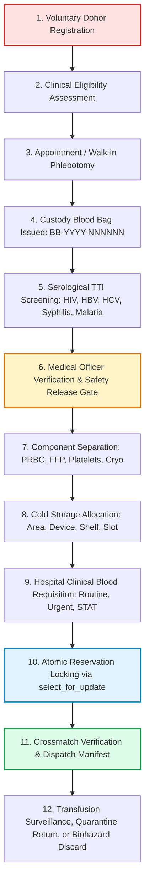

# LIFEFlow — Blood Bank Management & Hemovigilance System

[](https://github.com/phanindra267/Hemovigilance/actions)
[](https://www.djangoproject.com/)
[](https://www.python.org/)
[](https://opensource.org/licenses/MIT)
[-brightgreen.svg)](TESTING.md)
[](WORKFLOWS.md)
[-0284c7.svg)](ARCHITECTURE.md)

**LIFEFlow** is an enterprise-grade, production-oriented Blood Bank Management and Hemovigilance Information System built with **Python**, **Django**, and **Bootstrap 5**. Designed for regional transfusion centers, hospital blood banks, and healthcare authorities, it provides strict vein-to-vein unit traceability, cold chain governance, serological release gates, and atomic requisition management.

---

## Key Highlights

- **15 Modular Django Apps:** Domain-driven structure separating clinical, operational, and laboratory concerns.
- **Vein-to-Vein Unit Traceability:** Alphanumeric IDs for Donors (`DNR-`), Appointments (`APT-`), Blood Bags (`BB-`), Lab Samples (`SMP-`), Components (`CMPNT-`), Stock (`INV-`), Requisitions (`REQ-`), Issues (`ISS-`), and Discards (`DIS-`).
- **Atomic Concurrency-Safe Reservations:** `select_for_update()` row-level database locking ensures units cannot be double-booked during simultaneous emergency orders.
- **Medical Officer Safety Release Gate:** Quarantined units cannot enter available inventory until all 5 mandatory TTI viral screening assays (HIV, HBV, HCV, Syphilis, Malaria) are verified non-reactive by an authorized Medical Officer.
- **Cold Chain Governance:** Continuous physical storage tracking (+2°C to +6°C PRBC fridges, -40°C plasma freezers, +20°C to +24°C platelet incubators) with excursion alarm logging and automatic unit quarantine.
- **9 Granular User Roles:** SuperAdmin, Blood Bank Admin, Medical Officer, Lab Tech, Inventory Tech, Receptionist, Hospital Coordinator, Donor, and Patient with dedicated role-specific dashboards.
- **Automated Regulatory Reporting:** Real-time stock ledgers, discard root-cause analytics, and one-click **CSV** and **ReportLab PDF** downloads.
- **Modern Healthcare UI (v2.0):** Clean responsive clinical interface with live network indicators, stat cards, and one-click demo credentials picker.

---

## The Traceable 12-Stage Lifecycle



---

## Default User Accounts (Demo Logins)

All roles are seeded automatically via `python manage.py seed_demo_data`. All preconfigured accounts share the default password: **`password123`**.

| Role | Username | Password | Accessible Portals & Dashboards |
|---|---|---|---|
| **Super Administrator** | `admin` | `password123` | Global Administration, User Roles, Audit Logs, Settings |
| **Blood Bank Director** | `bb_admin` | `password123` | Operational Command Center, Facility Metrics, Staff Mgmt |
| **Medical Officer** | `doctor_rajesh` | `password123` | Lab Verification Gate, Clinical Requisitions, Assessments |
| **Laboratory Technician** | `tech_priya` | `password123` | Viral TTI Assays, Blood Bags, Component Processing |
| **Inventory Manager** | `tech_arun` | `password123` | Cold Storage Vault, Temperature Monitoring, Discards |
| **Phlebotomist / Front Desk** | `recep_meena` | `password123` | Donor Registration, Appointments, Phlebotomy Logs |
| **Hospital Coordinator** | `hospital_user` | `password123` | Clinical Blood Orders, Bedside Patient Tracking |
| **Voluntary Donor** | `donor_user` | `password123` | Donor Dashboard, Appointment Booking, Donation History |
| **Patient / Recipient** | `patient_user` | `password123` | Recipient Portal, Transfusion Records |

> [!TIP]
> On the sign-in page at `/accounts/login/`, you can simply click any role button in the **Demo Accounts** box to autofill the credentials immediately!

---

## Technology Stack

- **Backend:** Python 3.11–3.14, Django 6.0.6 (ORM, Forms, Auth, Admin)
- **Database:** SQLite for zero-config local development; production-ready for PostgreSQL 14+
- **Frontend:** Django Templates, Bootstrap 5.3.3, Bootstrap Icons 1.11.3, Custom Healthcare CSS (v2.0)
- **Reporting:** ReportLab (vector PDF generation), Python CSV Engine
- **Static Assets:** WhiteNoise for efficient, zero-config production static file serving
- **Testing:** Django TestCase (14 automated unit, integration, and lifecycle tests)
- **Deployment:** Gunicorn, Nginx reverse proxy, Docker, Docker Compose

---

## 15 Modular Django Applications

| Application | Description & Responsibilities |
|---|---|
| **`core`** | Organization master, configurable clinical thresholds (SOPs), global error handlers (400, 403, 404, 500), management commands |
| **`accounts`** | Custom `UserProfile`, 9 roles, RBAC decorators (`@role_required`), role-adaptive dashboards |
| **`donors`** | Donor registry, deferral date tracking, rare blood flags, eligibility questionnaires |
| **`appointments`** | Time-slot capacity validation, scheduling, reception check-in, cancellations |
| **`camps`** | Community donation drives, venue coordination, target metrics, self-registration |
| **`donations`** | Phlebotomy documentation, bag linkage, volume metrics, adverse donor reaction tracking |
| **`laboratory`** | Blood bag custody, sample aliquots, 5-assay TTI screening, Medical Officer release gate |
| **`blood_components`** | Component separation engine (PRBC, FFP, Platelets, Cryo), volume yields, shelf-life rules |
| **`inventory`** | Storage hierarchy (Area, Device, Position), cold chain temperature alerts, quarantine triage |
| **`requests_app`** | Hospital orders, urgency triage, `select_for_update()` atomic locks, issue manifests, returns |
| **`patients`** | Transfusion recipient directory, hospital MRN linkage, medical history |
| **`hospitals`** | Healthcare institutions master, licensing, tiers, contact persons |
| **`notifications`** | Real-time system notifications drawer, automated expiry alerts, urgent requisition alarms |
| **`reports`** | Dynamic reporting hub with live data tables and instant **CSV** / **ReportLab PDF** downloads |
| **`audit`** | Automated request middleware capturing user, IP, entity, and mutation details in immutable logs |

---

## Quickstart & Installation

### 1. Clone the Repository
```bash
git clone https://github.com/phanindra267/Hemovigilance.git
cd Hemovigilance
```

### 2. Create and Activate Virtual Environment
```bash
# Linux / macOS
python3 -m venv venv
source venv/bin/activate

# Windows
python -m venv venv
venv\Scripts\activate
```

### 3. Install Dependencies
```bash
pip install -r requirements.txt
```

### 4. Configure Environment
```bash
cp .env.example .env
# Default settings work out of the box with local SQLite!
```

### 5. Run Migrations & Seed Demo Data
```bash
python manage.py migrate
python manage.py seed_demo_data
```

### 6. Start the Development Server
```bash
python manage.py runserver
```

Visit **[http://127.0.0.1:8000](http://127.0.0.1:8000)** in your browser.

---

## Automated Management Commands

LIFEFlow includes automated administrative tasks for routine operations:

```bash
# Audit inventory and flag stock nearing or past expiration date
python manage.py check_expiry

# Audit inventory levels and trigger low-stock alerts across blood groups
python manage.py check_inventory

# Dispatch routine appointment reminders and pending lab screening alerts
python manage.py generate_notifications
```

---

## Running Automated Tests

LIFEFlow comes with a comprehensive test suite covering the entire 12-stage lifecycle, role access control, inventory concurrency, and PDF/CSV reporting:

```bash
python manage.py test --verbosity=2
```

Expected result:
```
Ran 14 tests in ~5.6s
OK
```

---

## Production Deployment

A complete production-ready Docker Compose and Nginx configuration is included:

```bash
# Build and run PostgreSQL, Gunicorn, and Nginx containers
docker compose up -d --build

# Run migrations inside the web container
docker compose exec web python manage.py migrate
docker compose exec web python manage.py collectstatic --noinput
docker compose exec web python manage.py seed_demo_data
```

For detailed bare-metal, systemd, or Nginx setup, see [DEPLOYMENT.md](DEPLOYMENT.md).

---

## Project Documentation Index

- [ARCHITECTURE.md](ARCHITECTURE.md) — Architectural patterns, cold chain schema, safety rules
- [DATABASE.md](DATABASE.md) — Entity-relationship models, primary keys, indexing strategy
- [WORKFLOWS.md](WORKFLOWS.md) — 12-stage vein-to-vein clinical state machine
- [SECURITY.md](SECURITY.md) — Role-based access control, session security, CSRF, audit logging
- [TESTING.md](TESTING.md) — Test plan, coverage matrix, automated test execution
- [DEPLOYMENT.md](DEPLOYMENT.md) — Nginx reverse proxy, Gunicorn, Docker, systemd services
- [API_OR_URL_REFERENCE.md](API_OR_URL_REFERENCE.md) — Exhaustive catalog of all 260+ system routes
- [CURRICULUM_MAPPING.md](CURRICULUM_MAPPING.md) — Academic syllabus compliance matrix across Units I to VI
- [CONTRIBUTING.md](CONTRIBUTING.md) — Contribution guidelines and development workflow
- [LICENSE](LICENSE) — Open Source MIT License

---

## License

This project is licensed under the **MIT License** — see the [LICENSE](LICENSE) file for details.
